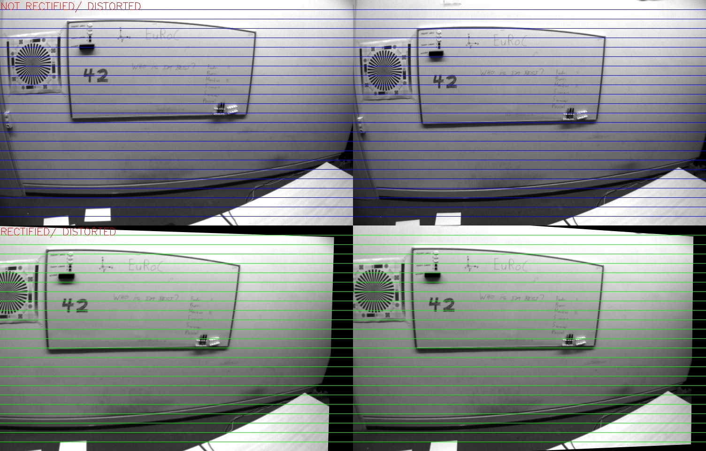
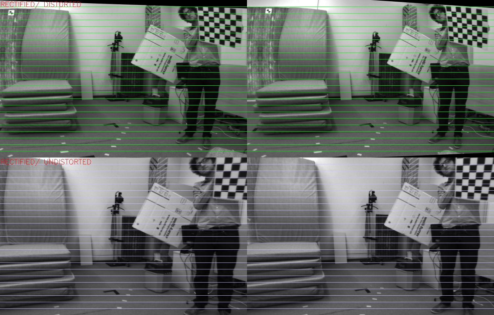

# 📝 Stereo Rectification/Calibration from almost^^ scatch #
***

This repository implements algorithms for stereo rectification/calibration using checkerboard patterns with the following procedures:

- estimate rectified homographies for left and right images using combination of uncalibrated methods of [Hartley](https://www.robots.ox.ac.uk/~vgg/hzbook/) and [Loop&Zhang](http://dev.ipol.im/~morel/Dossier_MVA_2011_Cours_Transparents_Documents/2011_Cours7_Document2_Loop-Zhang-CVPR1999.pdf)'s.

- estimate the remapping tables for undistortion. This requires each of the cameras' intrinsic parameters, which is out of scope of this repository. Therefore, opencv's functions are used for calculating monocular camera intrinsic matrix and distortion coefficients.

- this repository is for pure interest of better understanding of stereo calibration's mechanism/algorithms, so might not be suitable for production purpose.

## Sample Result Images ##
***

- rectification without undistortion



- rectification with undistortion



## :tada: TODO
***

- [x] estimation of fundamental matrix by eight-point algorithm, and refinement by gold-standard algorithm
- [x] estimation of uncalibrated rectification homographies based on combination of [Hartley](https://www.robots.ox.ac.uk/~vgg/hzbook/) and [Loop&Zhang](http://dev.ipol.im/~morel/Dossier_MVA_2011_Cours_Transparents_Documents/2011_Cours7_Document2_Loop-Zhang-CVPR1999.pdf)'s methods.
- [x] test on calibration board dataset


## 🎛  Dependencies
***

- from debian

```bash
sudo apt-get install \
    libopencv-dev \
    rapidjson-dev \
```

- [Ceres solver v.2.0.0](https://github.com/ceres-solver/ceres-solver)

## 🔨 How to Build ##
***

```bash
# build the lib
make default

# build examples
make apps
```

## :running: How to Run ##
***

- Download sample calibration data from [HERE](https://drive.google.com/file/d/1lkAEoEX_Vpdty2bNsn_4BeEQvwS_90ua/view?usp=sharing). This is modified version of [The EuRoC MAV Dataset](https://projects.asl.ethz.ch/datasets/doku.php?id=kmavvisualinertialdatasets) (custom calibration).

- Uncompress the data
```bash
tar -xf ./data/calibration_data.tar.xz -C ./data/
```

- Each monocular camera (left/right) has been calibrated separately, and the intrinsic calibration params can be seen in ./data/calibration/left(right)_calib_params.yml. You can also test the simple monocular camera calibration app in examples after build by:


```bash
./build/examples/mono_cam_intrinsic_calib ./data/calibration_data/left_param_config.json ./left_calib_params.yml

# or
./build/examples/mono_cam_intrinsic_calib ./data/calibration_data/right_param_config.json ./right_calib_params.yml
```

- Run stereo rectification app (that does estimation of fundamental matrix and image rectification)

```bash
./build/examples/stereo_rectification_app ./data/stereo_param_config.json ./data/sample_left.png ./data/sample_right.png
```

## :gem: References ##
***

1. [Computing Rectifying Homographies for Stereo Vision, CVPR 1999](http://dev.ipol.im/~morel/Dossier_MVA_2011_Cours_Transparents_Documents/2011_Cours7_Document2_Loop-Zhang-CVPR1999.pdf)
2. [Determining the Epipolar Geometry and its Uncertainty: A Review](https://www.cs.auckland.ac.nz/courses/compsci773s1c/resources/IJCV-Review.pdf)
3. [A “Loop and Zhang” Reader for Stereo Rectification](https://engineering.purdue.edu/kak/Tutorials/StereoRectification.pdf)
4. [Multiple View Geometry in Computer Vision](https://www.robots.ox.ac.uk/~vgg/hzbook/)
5. [Machine Vision Toolbox Matlab](https://github.com/petercorke/machinevision-toolbox-matlab)
6. [CS231A Course Notes 3: Epipolar Geometry](https://web.stanford.edu/class/cs231a/course_notes/03-epipolar-geometry.pdf)
